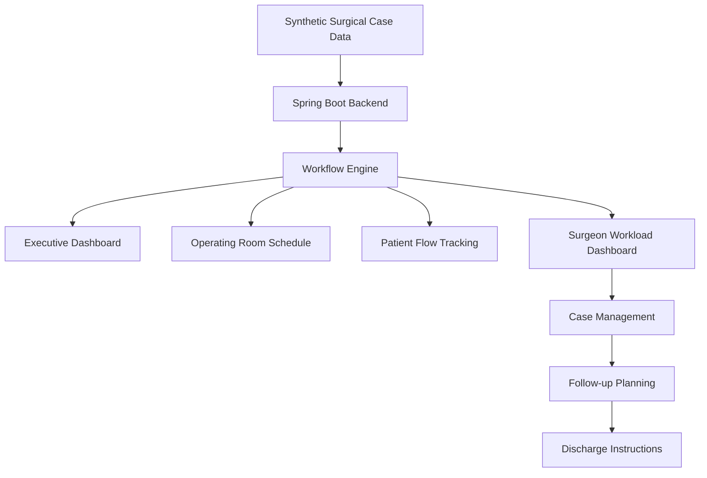

# 🏥 Surgical Workflow Automation Dashboard

Spring Boot healthcare operations dashboard that simulates surgical workflow automation, operating room scheduling, patient readiness tracking, surgeon workload management, follow-up planning, and discharge instruction management using synthetic healthcare data.

> Educational healthcare workflow project using synthetic data. Not intended for clinical use.

---

## ⭐ Project Highlights

* 🏥 Simulates end-to-end ambulatory surgery center workflows using synthetic healthcare data
* ⚙️ Built with Java and Spring Boot
* 📊 Executive dashboard for surgical operations analytics
* 🩺 Tracks patients through PRE-OP, IN OR, PACU, and DISCHARGED
* 🏥 Visualizes operating room scheduling and surgeon workload
* 📋 Generates follow-up recommendations and discharge instructions
* 🔄 Supports complete surgical case lifecycle management
* 📦 Supports both Maven and Conda development environments

---

## 🚀 Project Overview

This project simulates the operational workflows commonly performed within an ambulatory surgery center.

The dashboard centralizes surgical scheduling, operating room utilization, patient readiness tracking, surgeon workload management, follow-up planning, and discharge instruction generation into a single operational interface.

Although built using synthetic data for educational purposes, the workflow design was inspired by real-world healthcare operations to demonstrate how software engineering can improve clinical coordination, workflow visibility, and operational efficiency.

---

## 💡 Real-World Inspiration

This project was inspired by operational workflows observed while working in an ambulatory surgery center.

Daily responsibilities often required coordinating:

* Patient readiness
* Insurance verification
* Laboratory requirements
* Operating room assignments
* Surgeon availability
* Procedure scheduling
* Follow-up appointments
* Procedure-specific discharge instructions

This dashboard demonstrates how workflow automation and centralized dashboards can improve communication while reducing manual coordination across surgical teams.

---

## 🏗️ System Architecture



---

## 🏥 Dashboard Features

### Executive Summary

* Total Cases
* Pending Labs
* Insurance Holds
* Patients in PACU
* STAT Cases
* Ready for Surgery

### Daily Schedule Summary

* Cases Scheduled
* Ready Cases
* Pending Requirements
* Total OR Minutes
* Average Case Duration

### Operating Room Schedule

* Operating room assignment engine
* Procedure duration tracking
* Surgeon assignment visibility
* Operating room availability monitoring

### Patient Flow Tracking

* PRE-OP
* IN OR
* PACU
* DISCHARGED

### Case Status Distribution

* Scheduled
* In Surgery
* PACU
* Discharged
* Cancelled

### Workflow Automation

* Surgery readiness determination
* Follow-up scheduling recommendations
* Surgeon availability recommendations
* Procedure-specific discharge instructions
* Recovery scenario generation

### Case Management

* Create surgical cases
* Search cases
* Update workflow status
* Delete cases

---

## ⚙️ Technology Stack

### Backend

* Java
* Spring Boot
* Spring Data JPA
* REST API
* Maven

### Frontend

* HTML
* CSS
* JavaScript

### Database

* H2 Database

### Development

* Git
* GitHub
* VS Code
* Conda

---

## 🔧 Key Features

* Executive surgical operations dashboard
* Operating room scheduling
* Patient readiness tracking
* Workflow status management
* Surgeon workload visualization
* Case lifecycle management
* Follow-up recommendation generation
* Procedure-specific discharge instructions
* Search, update, and delete case management

---

## 📸 Dashboard Screenshots

### Executive Summary Dashboard

Provides a real-time overview of surgical operations including readiness, pending requirements, insurance holds, PACU volume, and daily case metrics.


---

### Operating Room Schedule

Displays operating room assignments, procedure information, surgeon assignments, and operating room availability.


---

### Patient Flow Board

Tracks patients as they move through PRE-OP, IN OR, PACU, and DISCHARGED workflow stages.


---

### Surgeon Workload Dashboard

Provides visibility into surgeon case assignments and workload distribution.


---

### Case Management List

Centralized view of all surgical cases including operating room assignment, procedure duration, readiness status, follow-up recommendations, surgeon availability, and discharge instructions.


---

## 🚀 Environment Setup

### Prerequisites

* Java 17
* Maven
* Python 3.11
* Conda (Miniconda or Anaconda)

### Clone the repository

```bash
git clone https://github.com/loveLaceLogic/surgical-workflow-automation-dashboard.git
cd surgical-workflow-automation-dashboard
```

### Create the Conda environment

```bash
conda env create -f environment.yml
```

### Activate the Conda environment

```bash
conda activate surgical-dashboard
```

### Run the Spring Boot application

```bash
./mvnw spring-boot:run
```

### Open the application

```text
http://localhost:8082
```

---

## 🚀 Future Improvements

* Role-based authentication
* PostgreSQL integration
* Docker deployment
* GitHub Actions CI/CD
* Real-time operating room updates
* HL7 message simulation
* FHIR interoperability exploration
* Interactive analytics dashboards
* Predictive surgical scheduling using machine learning

---

## ⚠️ Disclaimer

This project uses **synthetic educational healthcare workflow data** and is intended solely for software engineering demonstration and educational purposes.

It is **not intended for clinical decision-making, patient care, or use in production healthcare environments.**
