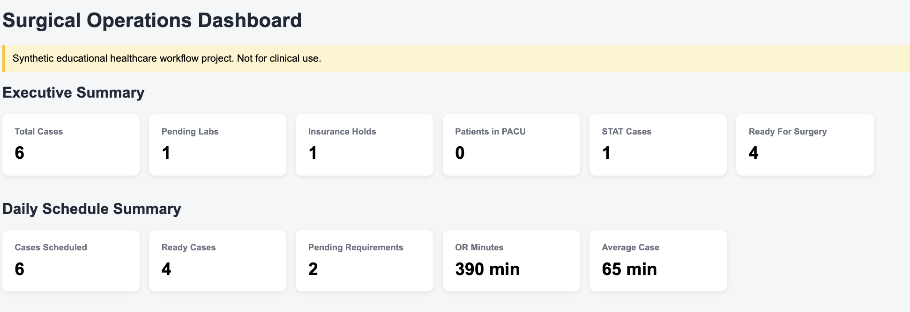
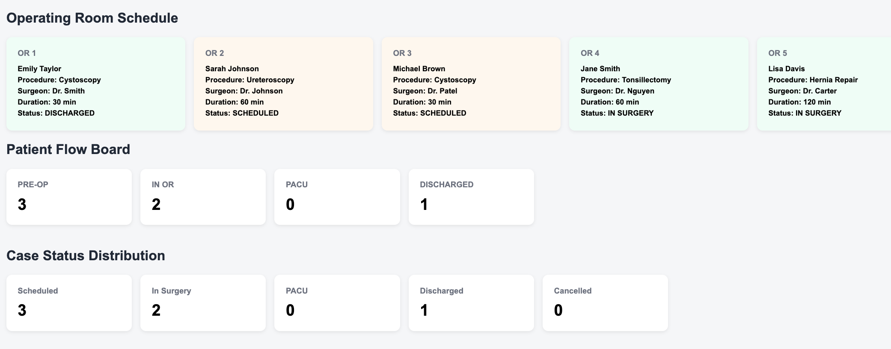
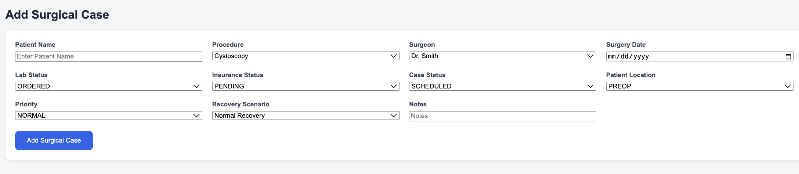
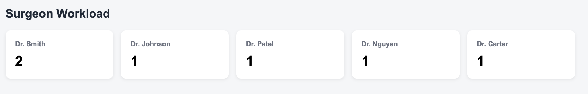
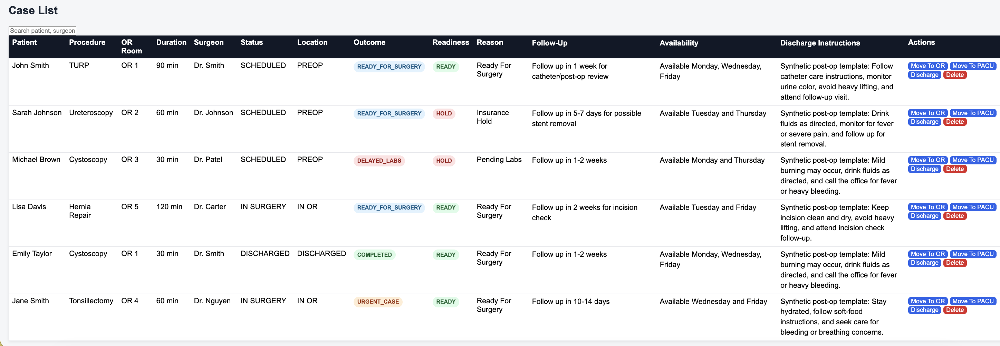

# Surgical Workflow Automation Dashboard

A Spring Boot and JavaScript healthcare operations dashboard designed to simulate surgical scheduling, readiness tracking, operating room utilization, follow-up planning, and discharge instruction automation.

> Educational healthcare workflow project using synthetic data. Not intended for clinical use.

---

## Project Overview

This project was inspired by operational workflows observed in a high-volume ambulatory surgery center.

In many surgical environments, staff must manually track:

* Patient readiness for surgery
* Lab and insurance requirements
* Operating room assignments
* Surgeon schedules
* Follow-up planning
* Procedure-specific discharge instructions

This dashboard centralizes those workflows into a single operational view.

---

## Real-World Inspiration

While working in a surgical center environment, discharge instructions and follow-up scheduling were often managed manually. Staff needed to remember surgeon-specific preferences, recovery workflows, and scheduling requirements across multiple providers and procedures.

This project simulates how workflow automation and dashboard analytics could improve operational visibility and reduce manual coordination.

---

## Features

### Executive Summary

* Total Cases
* Pending Labs
* Insurance Holds
* Patients in PACU
* STAT Cases
* Ready for Surgery

### Daily Schedule Summary

* Cases Scheduled
* Ready Cases
* Pending Requirements
* Total OR Minutes
* Average Case Duration

### Operating Room Schedule

* OR assignment engine
* Procedure duration tracking
* Surgeon assignment visibility
* OR availability monitoring

### Patient Flow Tracking

* PRE-OP
* IN OR
* PACU
* DISCHARGED

### Case Status Distribution

* Scheduled
* In Surgery
* PACU
* Discharged
* Cancelled

### Workflow Automation

* Surgery readiness determination
* Follow-up scheduling recommendations
* Surgeon availability recommendations
* Procedure-specific discharge instructions
* Recovery scenario generation

### Case Management

* Create cases
* Search cases
* Update workflow status
* Delete cases

---

## Technology Stack

### Backend

* Java
* Spring Boot
* Spring Data JPA
* Maven

### Frontend

* HTML
* CSS
* JavaScript

### Database

* H2 Database

---
## Screenshots

### Executive Summary Dashboard

Provides a high-level overview of surgical operations including readiness, pending requirements, insurance holds, PACU volume, and case counts.




---

### Operating Room Schedule

Displays operating room assignments, procedure information, surgeon assignments, and OR availability.



---

### Patient Flow Board

Tracks patients as they move through PRE-OP, IN OR, PACU, and DISCHARGED workflow stages.



---

### Surgeon Workload Dashboard

Provides visibility into surgeon case assignments and workload distribution.



---

### Case Management List

Centralized view of all surgical cases including operating room assignment, duration, readiness status, follow-up recommendations, surgeon availability, and discharge instructions.



---

## How To Run

Clone the repository:

```bash
git clone https://github.com/YOUR_USERNAME/Surgical-Workflow-Automation-Dashboard.git
```

Navigate to the project:

```bash
cd Surgical-Workflow-Automation-Dashboard
```

Start the application:

```bash
./mvnw spring-boot:run
```

Open:

```text
http://localhost:8082
```

---

## Project Architecture

```text
Frontend (HTML/CSS/JavaScript)
            │
            ▼
Spring Boot REST API
            │
            ▼
Business Logic Layer
            │
            ▼
H2 Database
```

---

## Future Enhancements

* Authentication and role-based access
* PDF discharge packet generation
* Procedure analytics dashboard
* Calendar integration
* Real-time notifications
* Multi-facility support

---

## Disclaimer

This project uses synthetic educational healthcare workflow data and is not intended for clinical decision making or patient care.
